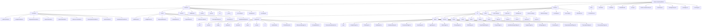

```mermaid
graph TD
    A[ebeno-research-platform] --> B[backend]
    A --> C[frontend]
    A --> D[docs]
    A --> E[Dockerfile]
    A --> F[LICENSE]
    A --> G[README.md]
    A --> H[dev.yml]
    A --> I[docker-compose.dev.yml]
    A --> J[firebase.json]
    A --> K[package-lock.json]
    A --> L[package.json]
    A --> M[tsconfig.json]

    B --> B1[controllers]
    B --> B2[routes]
    B --> B3[services]
    B --> B4[middleware]
    B --> B5[prisma]
    B --> B6[parsers]
    B --> B7[src]
    B --> B8[__tests__]
    B --> B9[jest.config.cjs]
    B --> B10[package.json]
    B --> B11[tsconfig.json]

    C --> C1[src]
    C --> C2[public]
    C --> C3[eslint.config.js]
    C --> C4[index.html]
    C --> C5[package.json]
    C --> C6[postcss.config.js]
    C --> C7[tailwind.config.js]
    C --> C8[tsconfig.json]
    C --> C9[vite.config.ts]
    C --> C10[README.md]

    D --> D1[ROADMAP.md]

    B1 --> B1a[authController.ts]
    B1 --> B1b[codingController.ts]
    B1 --> B1c[deepseekController.ts]
    B1 --> B1d[memoController.ts]
    B1 --> B1e[projectController.ts]
    B1 --> B1f[reference.controller.ts]
    B1 --> B1g[transcriptionController.ts]
    B1 --> B1h[userController.ts]
    B1 --> B1i[visualizationController.ts]

    B2 --> B2a[authRoutes.ts]
    B2 --> B2b[codingRoutes.ts]
    B2 --> B2c[deepseekRoutes.ts]
    B2 --> B2d[memoRoutes.ts]
    B2 --> B2e[projectRoutes.ts]
    B2 --> B2f[reference.routes.ts]
    B2 --> B2g[transcriptionRoute.ts]
    B2 --> B2h[userRoutes.ts]
    B2 --> B2i[visualizationRoutes.ts]

    C1 --> C1a[components]
    C1 --> C1b[pages]
    C1 --> C1c[services]
    C1 --> C1d[hooks]
    C1 --> C1e[stores]
    C1 --> C1f[types]
    C1 --> C1g[assets]
    C1 --> C1h[routes]
    C1 --> C1i[App.css]
    C1 --> C1j[App.tsx]
    C1 --> C1k[i18n.ts]
    C1 --> C1l[index.css]
    C1 --> C1m[main.tsx]

    C1a --> C1a1[auth]
    C1a --> C1a2[common]
    C1a --> C1a3[coding]
    C1a --> C1a4[deepseek]
    C1a --> C1a5[document]
    C1a --> C1a6[layout]
    C1a --> C1a7[memos]
    C1a --> C1a8[ui]
    C1a --> C1a9[visualizations]
    C1a --> C1a10[PrivateRoute.tsx]
    C1a --> C1a11[ReferenceManager.tsx]
    C1a --> C1a12[SurveyBuilder.tsx]
    C1a --> C1a13[TranscriptionUploader.tsx]

    C1b --> C1b1[auth]
    C1b --> C1b2[AnalysisPage.tsx]
    C1b --> C1b3[ChatPage.tsx]
    C1b --> C1b4[Dashboard.tsx]
    C1b --> C1b5[DashboardPage.tsx]
    C1b --> C1b6[DocumentsPage.tsx]
    C1b --> C1b7[HomePage.tsx]
    C1b --> C1b8[LoginPage.tsx]
    C1b --> C1b9[MemoPage.tsx]
    C1b --> C1b10[PrivacyPage.tsx]
    C1b --> C1b11[ProfilePage.tsx]
    C1b --> C1b12[ProjectDetailPage.tsx]
    C1b --> C1b13[ProjectsPage.tsx]
    C1b --> C1b14[QualitativeAnalysisPage.tsx]
    C1b --> C1b15[RegisterPage.tsx]
    C1b --> C1b16[SettingsPage.tsx]
    C1b --> C1b17[TermsPage.tsx]
    C1b --> C1b18[TranscriptionDetailPage.tsx]
    C1b --> C1b19[TranscriptionPage.tsx]
    C1b --> C1b20[TranscriptionsPage.tsx]
```